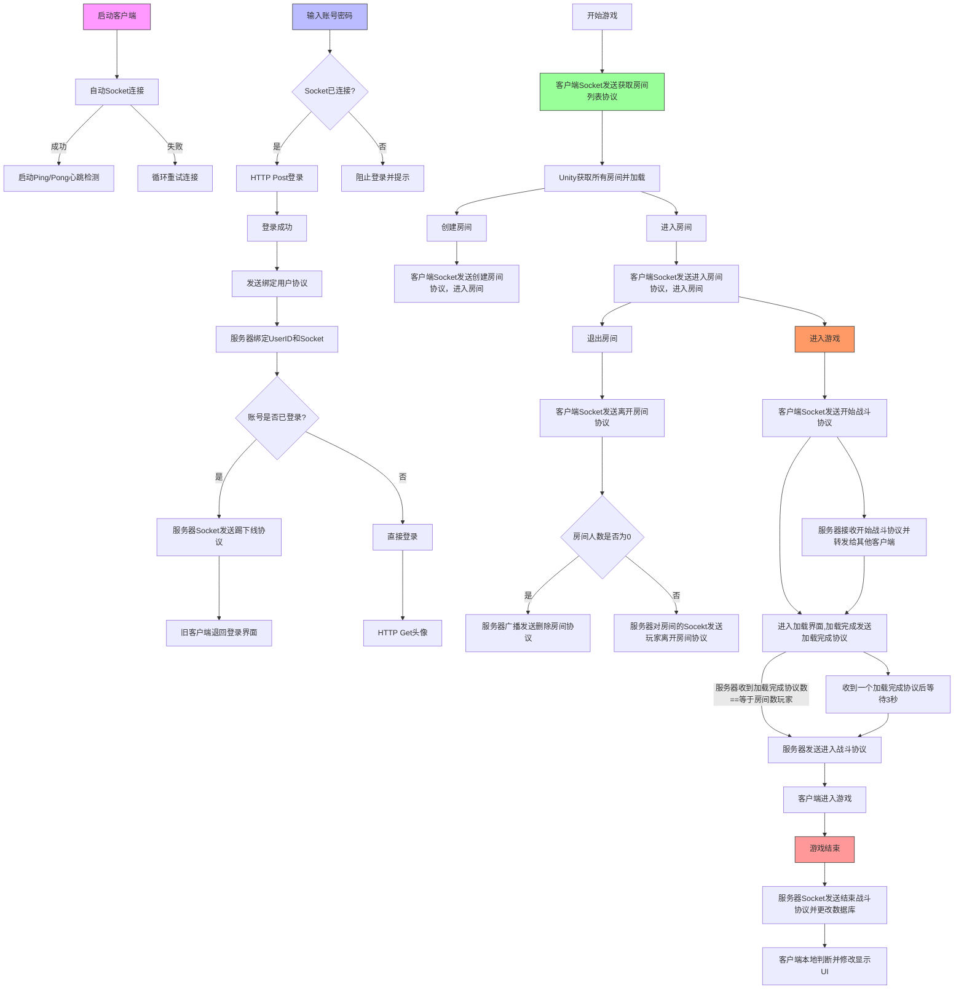
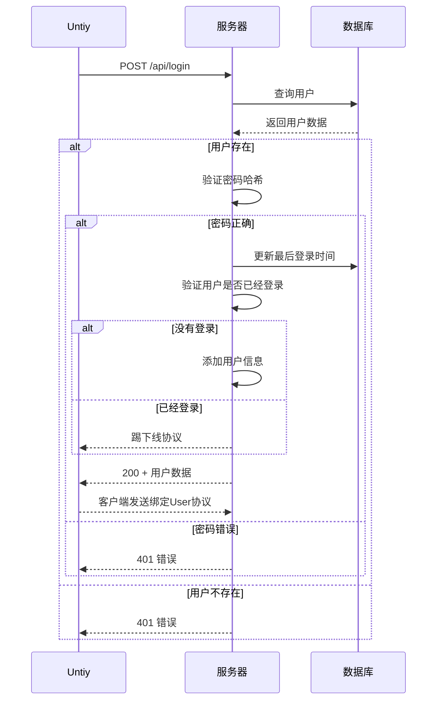
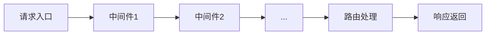
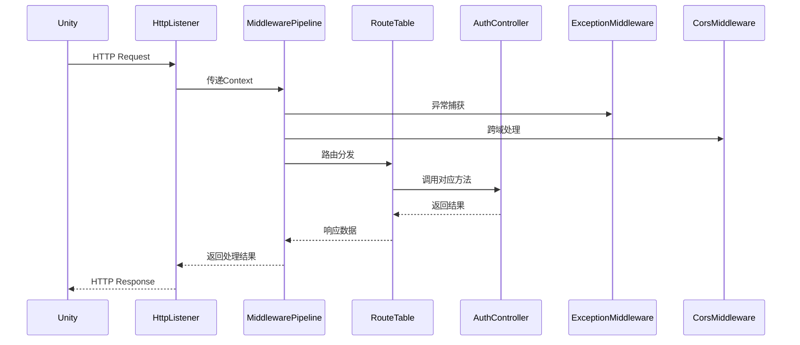
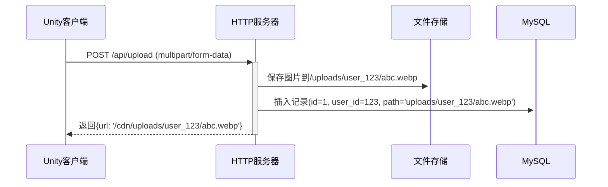
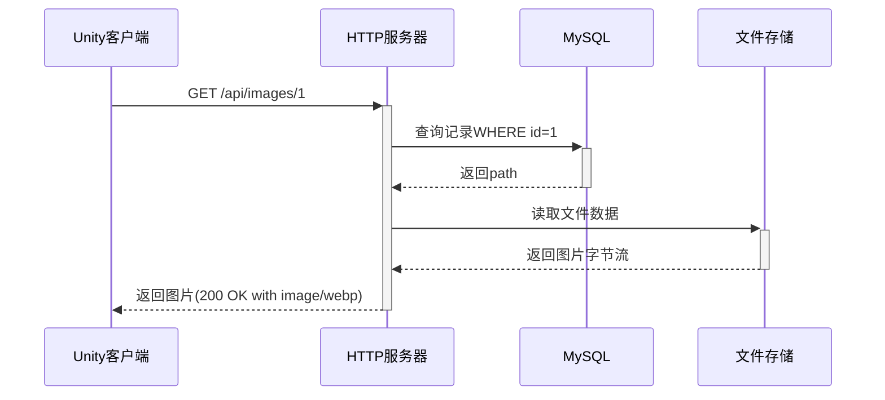
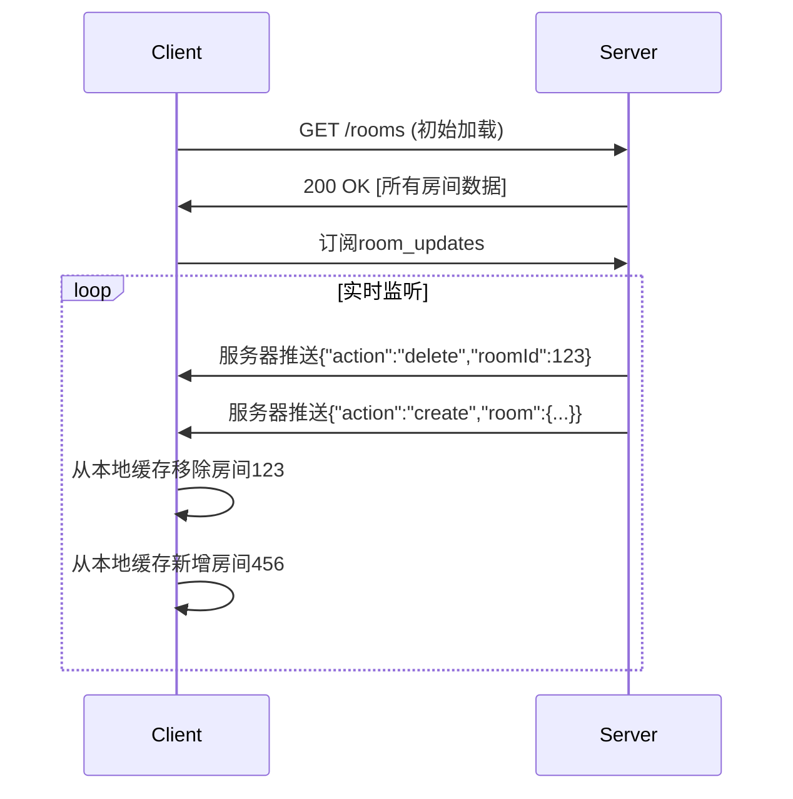
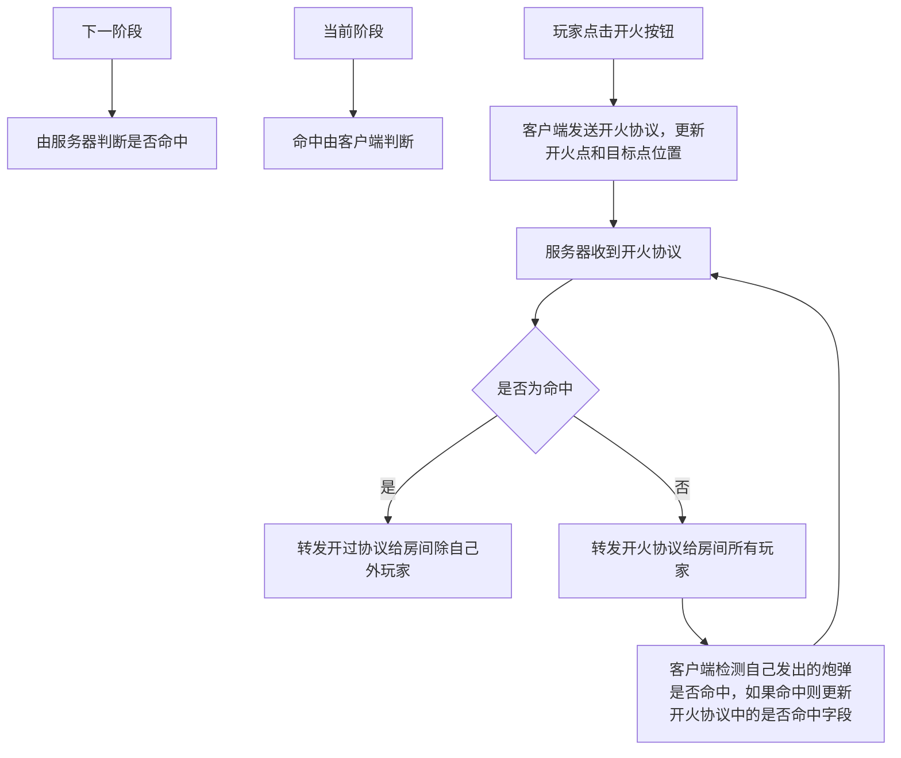

# 坦克先锋服务端

#### 流程图

#### 登录

#### 服务器HTTP

#### 头像上传流程

#### 头像下载流程

#### 打开房间大厅

------

#### 子弹逻辑

------

#### 文件安装

[Navicat、XAMPP](https://cloud.189.cn/t/v2yU7rjQjuuq（访问码：k1yq）)：https://cloud.189.cn/t/v2yU7rjQjuuq（访问码：k1yq）

[UI](https://www.figma.com/design/vitePE5vk3yjmvhUbn1WUJ/Battle-Simulator-Game--Community-?node-id=0-1&p=f&t=wCLfdAk8gCtfEXvk-0)：[Battle Simulator Game (Community) – Figma](https://www.figma.com/design/vitePE5vk3yjmvhUbn1WUJ/Battle-Simulator-Game--Community-?node-id=0-1&p=f&t=wCLfdAk8gCtfEXvk-0)